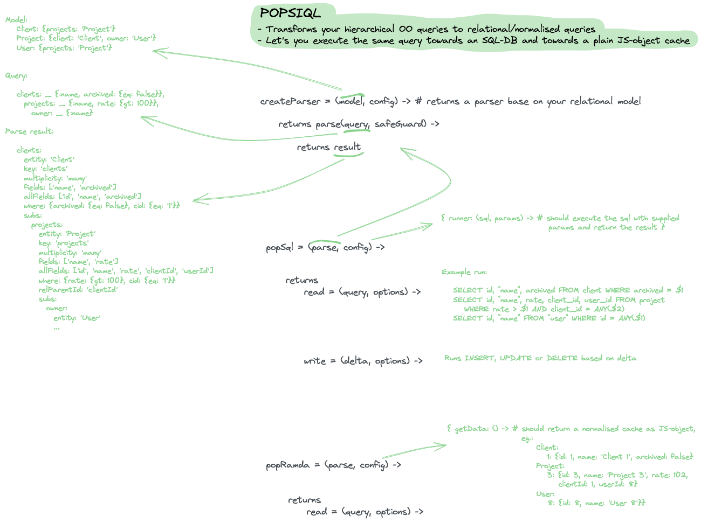

# POPSIQL
Plain Objects Producing a SImple Query Language

This is an experiment to implement a simplistic query language for data that can talk to both databases and local caches.

## Examples
Note that examples below uses coffeescript, keywordCoffeeLoader (:key), and `_ = (xs...) -> xs`

		# SETUP
		model =  
			Client: {projects: 'Project'}
			Project: {client: 'Client', owner: 'User'}
			User: {projects: 'Project'}

		data = ... # local cache
		runner = (sql, params) -> # runs sql query with params using node-pg and returns result.rows

		pop = popsiql model, {ramda: {data}, sql: {runner}}

		####### SIMPLE QUERY
		query = clients: _ {:name, :rank, archived: {eq: false}}

		pop.sql query
		# SELECT name, "rank", archived FROM client WHERE archived = false

		pop.ramda query
		# [{id: 1, name: 'Client1', rank: 'a'}, {id: 2, name: 'Client 2', rank: 'b'}]

		####### COMPLEX QUERY 
		query =
			clients: _ {:name, archived: {eq: false}},
				projects: _ {:name, rate: {gt: 100}},
					owner: _ {:name}
			user: _ {id: {eq: 99}, :name}
					
		pop.sql query
		# SELECT id, "name", archived FROM client WHERE archived = $1
		# SELECT id, "name", rate, client_id, user_id FROM project WHERE rate > $1 AND client_id = ANY($2)
		# SELECT id, "name" FROM "user" WHERE id = ANY($1)
		# SELECT id, "name" FROM "user" WHERE id = $1

		pop.ramda query
		#	clients: [
		#		{id: 1, name: 'Client 1', archived: false, projects: [
		#			{id: 2, name: 'Project 2', rate: 102, clientId: 1, userId: 1,
		#				owner: {id: 1, name: 'User 1'}}
		#		]},
		#		{id: 4, name: 'Client 4', archived: false, projects: [
		#			{id: 3, name: 'Project 3', rate: 110, clientId: 4, userId: 1,
		#				owner: {id: 1, name: 'User 1'}}
		#			{id: 4, name: 'Project 4', rate: 140, clientId: 4, userId: 2,
		#				owner: {id: 2, name: 'User 2'}}
		#		]}
		#	]
		# user: {id: 99, name: 'John Doe'}

## Architecture
*(Click the image to see the diagram in full screen.)*

